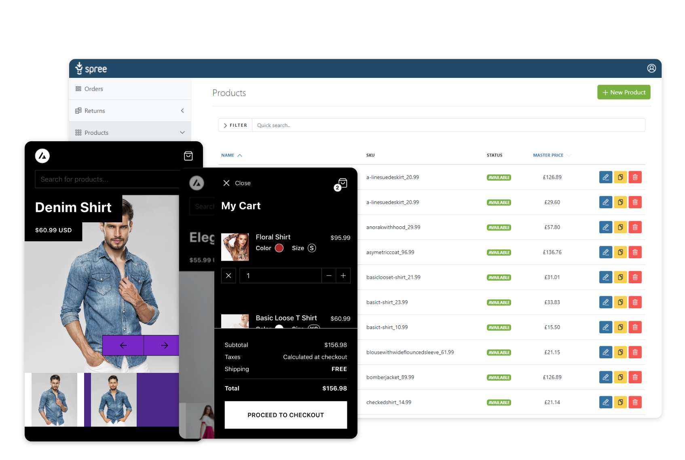

# Spree User Documentation

Welcome to the Spree User Guides! This documentation is intended for business owners and site administrators of Spree e-commerce sites. Everything you need to know to configure and manage your Spree store can be found here.

If you are a Spree developer, you may find the [Developer Guides](https://dev-docs.spreecommerce.org/) to be of benefit to you, though we strongly urge you to read through both sets of guides.

