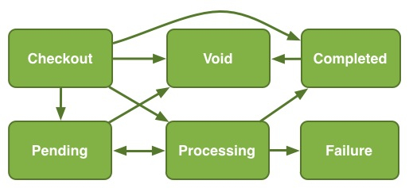

# Payment States

### [Introduction](https://guides.spreecommerce.org/user/payments/payment_states.html#introduction) 

When an order is initiated for a customer purchase, a payment is created in the Spree system. The payment goes through various states while being processed.

### [Payment States](https://guides.spreecommerce.org/user/payments/payment_states.html#payment-states) 

The possible payment states are:

* **Checkout** - The checkout has not been completed.
* **Processing** - The payment is being processed.
* **Pending** - The payment has been processed but is not yet complete \(eg. authorized but not captured\).
* **Failed** - The payment was rejected \(eg. credit card was declined\).
* **Void** - The payment should not be applied to the order.
* **Completed** - The payment is completed. Only payments in this state count against the order total.

Payment does not necessarily go through each of these states in sequential order as illustrated below:

You can determine the payment state for a particular order by going to the Admin Interface and clicking on the “Orders” tab. Find the order you want to look up and click on it. Then click on the “Payments” link.

The details for the payment will appear. The “Payment State” column will display one of the possible payment states listed above.

### [Authorize vs Capture](https://guides.spreecommerce.org/user/payments/payment_states.html#authorize-vs-capture) 

Authorizing a payment is the process of confirming the availability of funds for a transaction with the purchaser’s credit card company. Capturing a payment is the process of telling the credit card company that you would like to get paid for the transaction amount. Typically, this two-step process of first authorizing the payment and then capturing the payment is used by online retailers to delay charging the customer until the product\(s\) purchased have been fulfilled \(shipped\).

By default, Spree automatically handles authorizing the payment for a transaction. For capturing payments, we give you the choice of auto-capturing the payment or manually capturing the payment via the Admin Interface. If you like, you can read further [documentation about auto-capturing payments](https://guides.spreecommerce.org/developer/internals/payments.html#auto-capturing).

Note: Not all payment gateways allow for the two-step _authorize and then capture_ payment process. If this functionality is required for your store, please confirm with your payment gateway that they can support this process.

## [Capture a Payment via the Admin](https://guides.spreecommerce.org/user/payments/payment_states.html#capture-a-payment-via-the-admin) 

To capture a payment using the Admin Interface, click on the “Orders” tab. Find the order you want to look up and click on it. Then click on the “Payments” link. The order details will appear. Click on the “Capture” icon to initiate the capture process.

### [Void a Payment](https://guides.spreecommerce.org/user/payments/payment_states.html#void-a-payment) 

To void a payment, go to the Admin Interface and click on the “Orders” tab. Find the order you want to look up and click on it. Then click on the “Payments” link. The order details will appear. Click on the “Void” icon to void the transaction.

### [Edit the Payment Amount](https://guides.spreecommerce.org/user/payments/payment_states.html#edit-the-payment-amount) 

Additionally, before accepting or voiding the payment you can edit the amount by clicking the “Edit” button.

